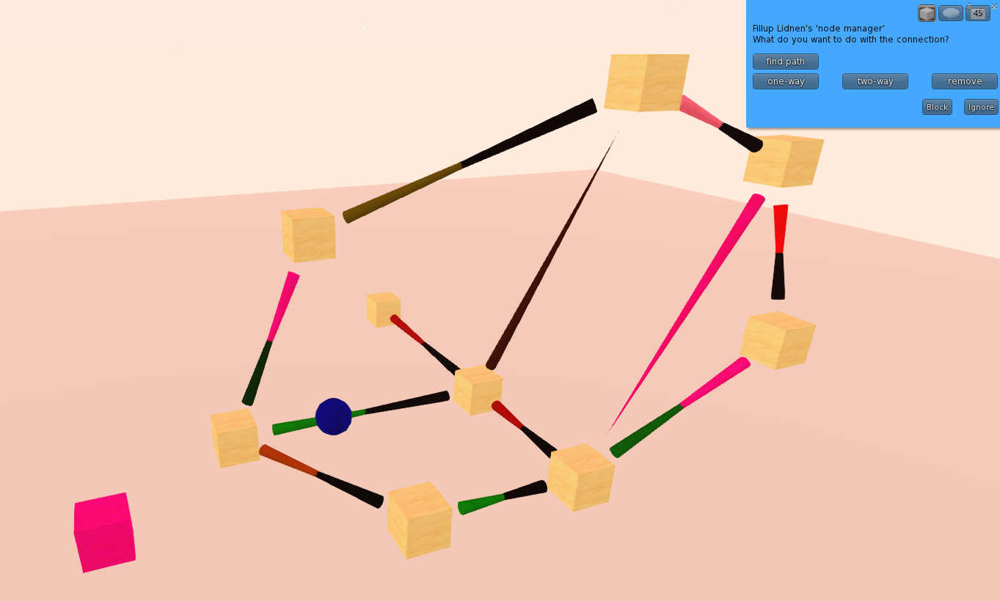
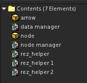

# In-SL Directed Graph Creation Tool

https://en.wikipedia.org/wiki/Directed_graph

Does basic pathfinding too. Neat.

The pathfinding component uses a modified form of [Dijkstra's algorithm](https://en.wikipedia.org/wiki/Dijkstra%27s_algorithm)
to select the optimal path given a set of relations between nodes. It's been tested with graphs consisting of 150~
nodes and 300~ relations.

Useful for if you need to do unusual pathfinding that doesn't map well to SL's built-in pathfinding system, like:

* Graphs containing path segments which may only be traversed in one direction
* Paths that intentionally pass through physical objects
* Paths that pass through the air
* Paths that are physically on rails and may not be traversed "naturally"

Maybe you can use it as the base of something else that needs in-world graph creation.

# Intro
Consists of:

* Node manager object to wrangle all the individual node objects and relational arrows
* Node objects, either rezzed manually or by the node manager when restored from its stored view of node relations
* Optional arrow objects rezzed by the node manager object that make it easier to visualize relations
* Objects are only rezzed in-world when editing the graph, otherwise it only requires a single prim.

## Nodes

* Identified by a randomly generated ID, persistent across rezzes and script restarts
* Shift dragging a node makes the node calculate a new ID and create a relation with the original node
* Tracked by a "node manager"
* Clicks on nodes and arrows are reported back to the node manager to handle
* Clicking one node then another allows you to create a unidirectional or bidirectional relationship between them

## Node Manager

* Keeps track of any nodes rezzed in-world and their relationships
* Allows creating relationships by clicking one node then another
* Allows creating either bidirectional or unidirectional relationships with a single click via dialog
* Allows removing existing relationships
* Allows removing nodes and any of its relationships
* Allows visualizing relationships between nodes by rezzing arrows appropriately
* Has option to clear in-world nodes and recreate based on the data manager's view

# Setup

* Create a prim, call it "node manager"
* * Take the contents of [compiled/node_manager.o.lsl](compiled/node_manager.o.lsl) and create a script in the object, call it "node manager"
* * Take the contents of [compiled/data_manager.o.lsl](compiled/data_manager.o.lsl) and create a script in the object, call it "data manager"
* * Take the contents of [compiled/rez_helper.o.lsl](compiled/rez_helper.o.lsl) and create a script in your inventory, call it "rez_helper"
* * * Drag 3 copies of the script into the "node manager" object
* Create a prim, call it "node"
* * Take the contents of [compiled/node.o.lsl](compiled/node.o.lsl) and create a script in the object
* * Take the "node" object and put it in the "node manager" object's inventory.
* Create a prim, call it "arrow"
* * Take the contents of [compiled/arrow.o.lsl](compiled/arrow.o.lsl) and create a script in the object
* * Take the "arrow" object and put it in the "node manager" object's inventory.

The "node manager" object's inventory should now look something like:

# Usage

To start a new graph, drag a "node" object out of the "node manager"'s inventory.

You can shift-duplicate any rezzed "node" object, it should automatically create a relation between
the it and the duplicated node.

You can change or add relations between any two existing node by clicking the desired source node, then
the desired destination node.

Clicking the "node manager" object will bring up a menu:

* restore - Rez a representation of the stored graph
* rest. norel - Rez a representation of the stored graph without any relational arrows (saves prims)
* clear - Derez the representation of the graph (stored version is still kept)
* dump - dump a textual representation of all nodes and relations to chat
* save - store the in-world representation of the graph to the data manager, needs to be done to update pathfinding view

See [pathfinder_example.lsl](pathfinder_example.lsl) for an example of how scripts can ask for paths.

# License

GPL v3. My interpretation of the anti-tivoization clause in the GPL v3 in relation to SL means that your objects
_must_ be modifiable when distributed so people can replace the GPL'd scripts. Other scripts in the object need
not be modifiable or licensed under the GPL even if they communicate with these scripts.
